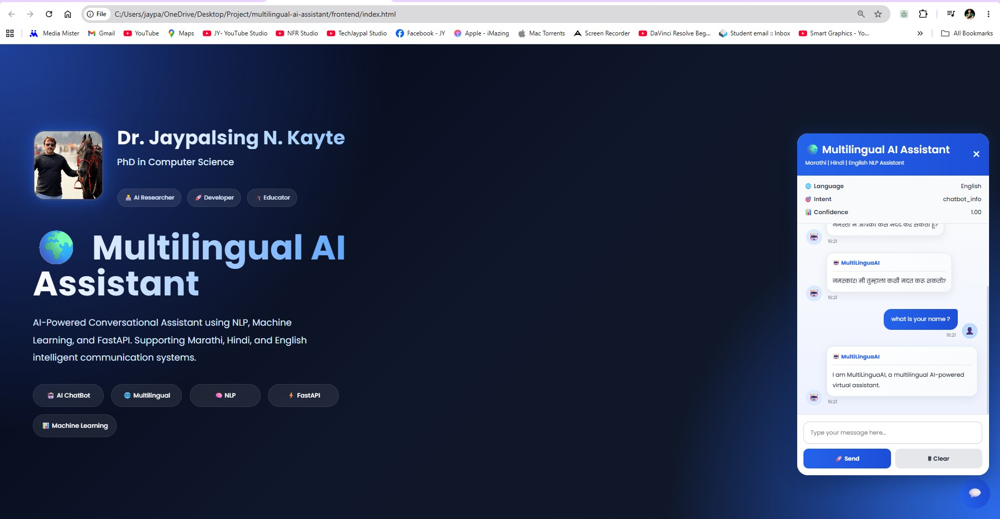

````md
# 🌍 MultiLinguaAI

## 🚀 AI-Powered Multilingual Conversational Assistant

MultiLinguaAI is an intelligent multilingual conversational assistant developed using **FastAPI, NLP, Machine Learning, and JavaScript**. The system supports communication in multiple languages including **English, Hindi, and Marathi** with intelligent intent recognition and service-based response generation.

The project provides a modern AI chatbot interface with multilingual NLP processing, confidence scoring, service search capability, and interactive frontend UI.

## Dashboard Preview




---

# 📌 Features

    ✅ Multilingual Support (English, Hindi, Marathi)  
    ✅ NLP-Based Intent Classification  
    ✅ FastAPI Backend API  
    ✅ Interactive Modern Chat UI  
    ✅ Confidence Score Prediction  
    ✅ Language Detection  
    ✅ Service Search System  
    ✅ Conversation Memory  
    ✅ Responsive Design  
    ✅ Real-Time Chat Interface  
    ✅ AI-Powered Virtual Assistant  

---

# 🧠 AI & NLP Capabilities

    - Intent Classification
    - Language Detection
    - Response Generation
    - Service Recommendation
    - Conversation Handling
    - Multilingual Query Processing

---

# 🛠️ Technologies Used

## Backend
    - Python
    - FastAPI
    - Uvicorn
    - Scikit-learn
    - NLP
    - Machine Learning

## Frontend
    - HTML5
    - CSS3
    - JavaScript

## AI/NLP
    - TF-IDF Vectorization
    - Logistic Regression
    - Intent Prediction
    - Language Detection

---

# 📂 Project Structure

```bash
MultiLinguaAI/
│
├── backend/
│   ├── app.py
│   ├── nlu.py
│   ├── service_search.py
│
├── frontend/
│   ├── index.html
│   ├── style.css
│   ├── script.js
│
├── models/
│
├── data/
│
├── requirements.txt
│
├── README.md
│
└── .gitignore
````

---

# ⚙️ Installation

## 1️⃣ Clone Repository

```bash
git clone https://github.com/jaypalsing/multilinguaai.git
```

---

## 2️⃣ Open Project

```bash
    cd multilinguaai
```

---

## 3️⃣ Create Virtual Environment

```bash
    python -m venv venv
```

---

## 4️⃣ Activate Environment

### Windows

```bash
    venv\Scripts\activate
```

### Linux / Mac

```bash
    source venv/bin/activate
```

---

## 5️⃣ Install Dependencies

```bash
    pip install -r requirements.txt
```

---

# ▶️ Run Backend Server

```bash
    uvicorn backend.app:app --reload
```

Backend URL:

```bash
        http://127.0.0.1:8000
```

Swagger API Docs:

```bash
        http://127.0.0.1:8000/docs
```

---

# 🌐 Run Frontend

Open:

```bash
    frontend/index.html
```

OR use VS Code Live Server.

---

# 💬 Example Queries

## English

    * Hello
    * Help me
    * Show hospitals
    * Bank near me

## Hindi

    * नमस्ते
    * अस्पताल दिखाइए
    * मदद चाहिए

## Marathi

    * नमस्कार
    * हॉस्पिटल दाखवा
    * मदत करा

---

# 📊 API Example

## Request

```json
{
  "message": "Hello"
}
```

## Response

```json
{
    "message": "Hello",
    "language": "English",
    "intent": "greeting",
    "confidence": 0.95,
    "reply": "Hello! Welcome to MultiLinguaAI."
}
```

---

# 🧪 Current Features

    | Feature               | Status |
    | --------------------- | ------ |
    | Multilingual NLP      | ✅      |
    | Intent Classification | ✅      |
    | Service Search        | ✅      |
    | FastAPI API           | ✅      |
    | Responsive UI         | ✅      |
    | Confidence Prediction | ✅      |
    | Conversation Memory   | ✅      |

---

# 🚀 Future Improvements

    * Voice Assistant
    * Speech-to-Text
    * Text-to-Speech
    * OpenAI/Gemini Integration
    * LLM Support
    * RAG System
    * Database Integration
    * User Authentication
    * Chat History
    * Docker Deployment
    * Cloud Hosting

---

# 📸 Screenshots

## Main Dashboard

    (Add screenshot here)

## Chat Interface

    (Add screenshot here)

## Swagger API

    (Add screenshot here)

---

# 👨‍💻 Developer

## Dr. Jaypalsing N. Kayte

    PhD in Computer Science

    AI Researcher | NLP Engineer | Machine Learning Developer | FastAPI Developer

---

# 📜 License

    This project is developed for educational, research, and AI application development purposes.

---

# ⭐ GitHub

    If you like this project, give it a ⭐ on GitHub.

```
```
